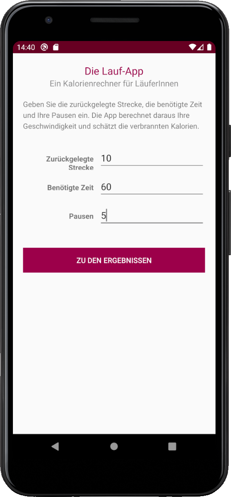
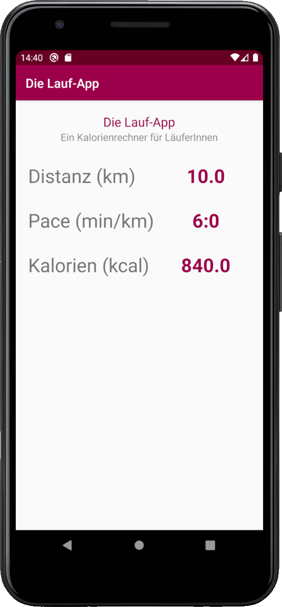
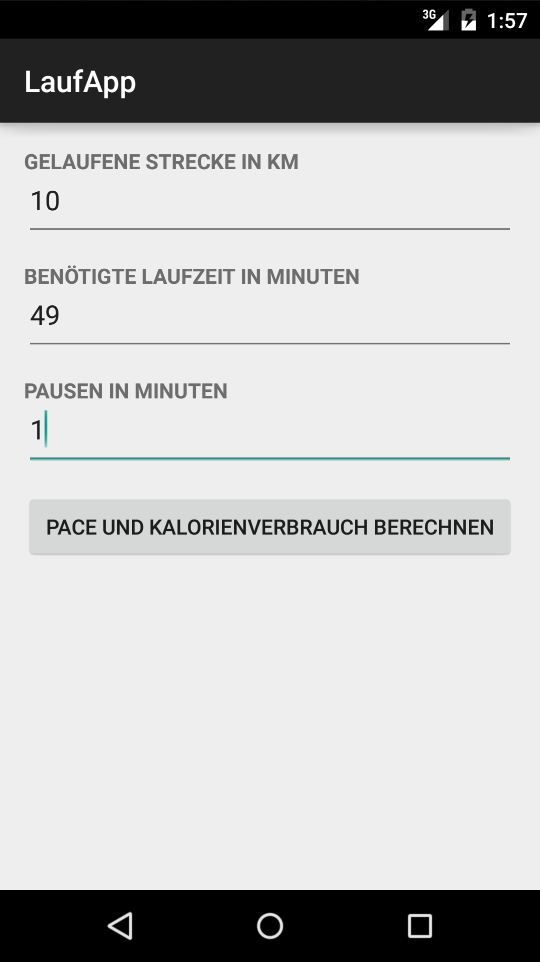
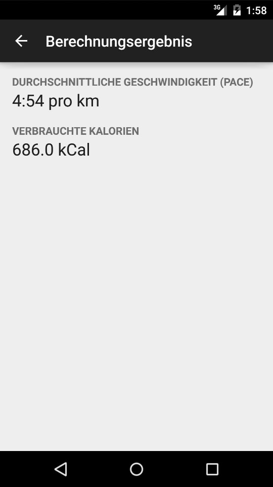

# 03 | Laufapp

## Downloads

- [Download des Starterpakets](https://github.com/Android-Regensburg/U03-Laufapp/archive/master.zip)
- [Download des Lösungsvorschlag](https://github.com/Android-Regensburg/U03-Laufapp/archive/solution.zip)

## Aufgabe

Schreiben Sie eine Anwendung, mit der durch Eingabe der zurückgelegten Strecke, der dafür benötigten Zeit und eventuell eingelegten Pausen die Durchschnittsgeschwindigkeit (*Pace* in min/km) und der Kalorienverbrauch berechnet werden.

Benutzen Sie eine `Activity`, `EditText`-Views um die Eingabe zu ermöglichen sowie weitere Views und Buttons für die beschriebenen Funktionen.

Dem Nutzer soll es möglich sein, die Strecke (in km), die Zeit (in min) und die Pausen (in min) anzugeben und sich anschließend durch Drücken eines Buttons das Ergebnis anzeigen zu lassen.

## Hinweise

* Die Abfrage des eingegebenen Inhalts eines `EditTexts` erfolgt über getter-Methoden. Um mögliche Fehleingaben vorzubeugen, kann dem Nutzer gleich bei Auswahl eine Zahlentastatur angezeigt werden. Hierzu kann das Attribut `inputType` entsprechend gesetzt werden. (`inputType` für Eingabefelder finden Sie in der API unter http://developer.android.com/reference/android/R.attr.html#inputType).

* Sie können in der `Activity` zusätzliche Methoden definieren. Nutzen Sie dies, um bestimmte Abläufe auszulagern. Die Berechnungen (*Pace*, Kalorien) übernimmt die bereitgestellte `Calculator`-Klasse.
* Methoden und Attribute der in der Android-Programmierung verwendeten Klassen können in der Android-API-Dokumentation eingesehen werden: http://developer.android.com/reference/packages.html

* Methoden und Attribute der in der Java-Programmierung verwendeten Klassen können in der Java-API-Dokumentation eingesehen werden: http://docs.oracle.com/javase/7/docs/api/

* Nutzen Sie die automatische Codevervollständigung durch die Entwicklungsumgebung. Hinweise zur Beseitigung von Fehlern erhalten Sie mittels `Alt + Enter`. Mehr hierzu unter https://developer.android.com/sdk/installing/studio-tips.html 

## Vorgehen

### Teil 1:
   1. Laden Sie das Starter-Paket zur Übung herunter. Dabei handelt es sich um ein leeres Standardprojekt, das nur um die Klasse `Calculator` erweitert worden ist.
   2. Diese Klasse stellt die drei öffentlichen Methoden `setValues(int distance, int time, int pause)`, `calculatePace()` und `calculateKcal()` zur Verfügung.
   3. Verändern Sie das vorgegebene Layout. Stellen Sie sicher, dass Sie ein `LinearLayout` verwenden. Es werden drei Elemente für die Eingabe (`EditText`) und drei Labels (`TextView`) benötigt. Außerdem sind ein `Button`, der die Berechnung startet, sowie ein Textfeld, welches das Ergebnis anzeigt, erforderlich.
   4. Ergänzen Sie `strings.xml` um Elemente für Beschriftung der `TextViews` und des `Buttons`.
   5. Erstellen Sie notwendige Klassenvariablen (nur) für die zu manipulierenden Views (Werte auslesen oder Listener).
   6. Referenzieren Sie die Views in der `onCreate()`-Methode. Weisen Sie dem Button einen `OnClickListener` zu:
      1. Nutzen Sie das bekannte Vorgehen, um die `onClick()`-Methode zu überschreiben.
      2. Lesen Sie in der `onClick()`-Methode die eingegebenen Werte aus und berechnen Sie aus diesen Werten die Durchschnittsgeschwindigkeit und den Kalorienverbrauch. Nutzen Sie dazu die bereitgestellte Klasse `Calculator`.
      3. Geben Sie anschließend das Ergebnis in den entsprechenden `TextViews` aus.
      4. Sorgen Sie dafür, dass mögliche Falscheingaben behandelt werden, z.B. ein Wort anstatt einer Zahl. 
### Teil 2: Intents und Extras
1. Bauen Sie die App um. Das Ergebnis soll jetzt in einem zweiten Bildschirm angezeigt werden. Auf diesem befinden sich nur die `Views` für die Anzeige der Ergebnisse. Verwenden Sie die Möglichkeit, an `Intents` `Extras` anzuhängen, um die Werte aus den Textfeldern in die andere `Activity` zu schicken. Dort nutzen Sie dann wie gehabt die `Calculator`-Klasse zur Berechnung des Ergebnisses.
2. Verwenden Sie als Schlüssel (*Key-Value*-Mechanismus) für die `Extras` keine hart kodierten `Strings`, sondern lagern Sie diese in eine Klasse `Constants.java` aus.
3. Sorgen Sie nun abschließend dafür, dass die Ergebnisse in einem sinnvollen Format dargestellt werden: Kalorien auf zwei Nachkommastellen gerundet (verwenden Sie die Klasse `DecimalFormat` der Java-API) und die Pace umgerechnet in Minuten und Sekunden (Das Ergebnis von `calculatePace()` ist dezimal, d.h. ein Ergebniswert von 4,5 bedeutet 4 Minuten 30 Sekunden).

## Anhang
### Screenshots

  

