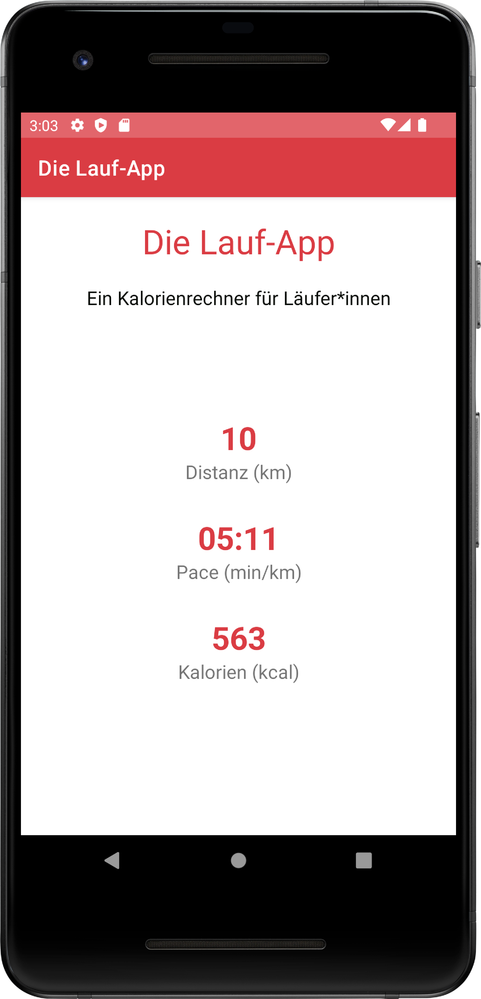

# 03 | Laufapp

## Aufgabenstellung

In dieser Aufgaben implementieren Sie eine App, die NutzerInnen die Berechnung des Kalorienverbrauchs beim Sport erlaubt. Durch die Eingabe der zurückgelegten Strecke, der dafür benötigten Zeit und eventuell eingelegten Pausen wird die Durchschnittsgeschwindigkeit (*Pace* in min/km) berechnet und der Kalorienverbrauch geschätzt. Die notwendigen Daten zur Berechnung des Kalorienverbrauchs werden in der `StartActivity` von den NutzerInnen eingegeben. Die Ergebnisse der Berechnung werden in einer zweiten *Activity* angezeigt.

## Hinweise

- Verwenden Sie für die Berechnung des Kalorienverbrauchs und des *Pace* die Klasse `Run`, die Sie im _Package_ `data` des Starterpakets finden. Instanzen der Klasse repräsentieren einzelne Läufe. Dem Konstruktor werden Distanz, Gesamtzeit und Pausenzeit übergeben. Die genaue Verwendung der Klasse wird über Kommentare im Quellcode beschrieben.
- Verwenden Sie für die Eingabe der notwendigen Daten `EditText`-Elemente. Um mögliche "Fehleingaben" direkt auszuschließen, können Sie über den [Input Type](https://developer.android.com/training/keyboard-input/style) festlegen, welche Art von Text (Zahlen, Telefonnummer, Passwörter) über ein bestimmtes `EditText` eingegeben werden kann.
- Denken Sie an die qualitative hochwertige Gestaltung des Quellcodes. Verwenden Sie zusätzliche Methoden um Ihren Code zu strukturieren. Lagern Sie Beschriftungen konsequent in die Ressourcen-Dateien aus. Verwenden Sie *Activity*-übergreifend zugängliche Konstanten, um Werte in den *Intent*-Extras zu identifizieren. Nutzen Sie passende Bezeichner für Variablen und Methodennamen. Überarbeiten Sie Ihren Code regelmäßig und gewöhnen Sie sich an, [stets nach Verbesserungsmöglichkeiten zu suchen](https://martinfowler.com/bliki/OpportunisticRefactoring.html).

## Vorgehen

### Starterpaket

Laden Sie sich das Starterprojekt herunter, das Sie links auf dieser Seite finden. Entpacken Sie den Projektordner auf Ihrem Rechner und öffnen Sie das Projekt in *Android Studio*. Beim ersten Start synchronisiert *Android Studio* die Projektinhalte und installiert ggf. noch fehlende Abhängigkeiten. Das merken Sie an einem Fortschrittsbalken unten rechts in der IDE. Testen Sie anschließend, ob Sie die Anwendung im vorgegebenen Zustand im Emulator ausführen können. **Im Starterpaket finden Sie auch die `StatsHelper`-Klasse für die Berechnung der Geschwindigkeit und der verbrannten Kalorien.**

### Schritt 1: Das User Interface für die erste Activity

Erstellen Sie ein passendes Layout für die erste Activity. Sie benötigen Eingabefelder für die zurückgelegte Distanz, die benötigte Zeit und etwaige Pausen. Denken Sie daran, den NutzerInnen durch entsprechende Beschriftungen (_Hints_) mitzuteilen, was in die Felder eingetragen werden soll. Zusätzlich wird im *User Interface* dieser *Activity* auch ein *Button* benötigt, der den Wechsel zum nächsten Bildschirm auslösen soll.

**Zwischenziel**: Beim Starten der Anwendung wird die erste Activity mit den für die Dateneingabe notwendigen UI-Elementen angezeigt.

### Schritt 2: Auslesen der Eingabedaten

Sorgen Sie dafür, das beim Klick auf den erstellten *Button* die aktuellen Inhalte der Eingabefelder ausgelesen werden. Sie benötigen Informationen über die gelaufene Distanz, die benötigt Zeit und die Dauer etwaiger Pausen. Geben Sie die ausgelesenen Daten zuerst über die `Log.d`-Methode aus und überprüfen Sie so Ihre bisherige Programmlogik.

**Zwischenziel**: Beim Klick auf den Button werden die aktuellen Werte aus den Eingabefelder in der Debugging-Konsole in _Android Studio_ (_LogCat_) angezeigt.

### Schritt 3: Wechsel zu einer neuen Activity

Erstellen Sie eine neue Activity inkl. noch leerer Layout-Datei, in der später die Ergebnisse des Laufs angezeigt werden sollen. Wechseln Sie, wenn die Nutzer\*innen den Button der ersten Activity angeklickt haben, per _Intent_ in die neue Actitivity. Übergeben Sie dabei die ausgelesenen Informationen der Eingabefelder als _Extras_ an die neue Activity. Prüfen Sie, ob die Werte korrekt übergeben wurden, in dem Sie die _Extras_ in der zweiten Activity auslesen und wieder per `Log.d` ausgeben.

**Zwischenziel**: Beim Klick auf den Button wird die zweite Activity gestartet. Die von den Nutzer\*innen eingegebenen Daten werden im _Intent_ übergeben und nach dem Start der zweiten Activity in der Debugging-Konsole in _Android Studio_ (_LogCat_) angezeigt.

### Schritt 4: Ein UI für die neue Activity

Bearbeiten Sie die Layout-Datei der zweiten Activity. Ergänzen Sie die notwendigen Elemente, um später die Ergebnisse des Laufs, d.h. Distanz, _Pace_ und umgesetzte Kalorien anzeigen zu können. Dabei können Sie sich an den Screenshots unten auf diesem Übungsblatt orientieren.

**Zwischenziel**: Beim Wechsel in die zweite Activity werden die notwendigen UI-Elemente zur Darstellung der Laufergebnisse angezeigt.

### Schritt 5: Anzeigen der Ergebnisse

Verwenden Sie die übergebenen Daten, um in der zweiten Activity sinnvolle Ergebnisse für die Nutzer\*innen anzuzeigen. Erstellen Sie dazu aus den via _Intent_ übergebenen Informationen ein `Run`-Objekt. Achten Sie dabei auf die korrekte Umrechnung der Werte und informieren Sie sich dazu in den Quellcodekommentaren, wie genau der Konstruktor der `Run`-Klasse funktioniert. Verwenden Sie die Informationen aus dem `Run`-Objekt, um die Laufergebnisse für die Nutzer\*innen anzuzeigen. Denken Sie daran, die Informationen für eine nutzerfreundliche Anzeige zu optimieren, in dem Sie die umgesetzten Kalorien sinnvoll runden und den _Pace_ im Format `MM:SS` also z.B. `05:40` anzeigen.

**Zwischenziel** Beim Wechsel in die zweite Activity werden die berechneten Laufergebnisse in sinnvoller Art und Weise angezeigt.

## Screenshots der Anwendung

| Activity zur Eingabe der Laufdaten | Activity zur Anzeige der berechneten Ergebnisse |
|:------:|:------:|
|  |  |
